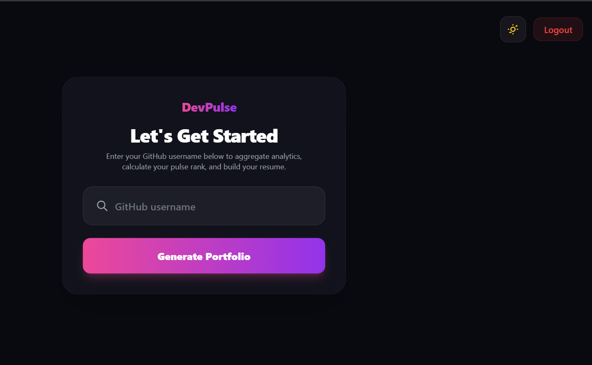
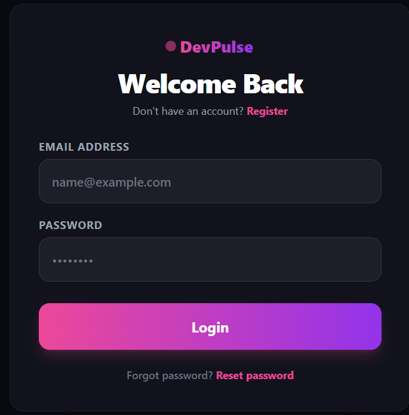
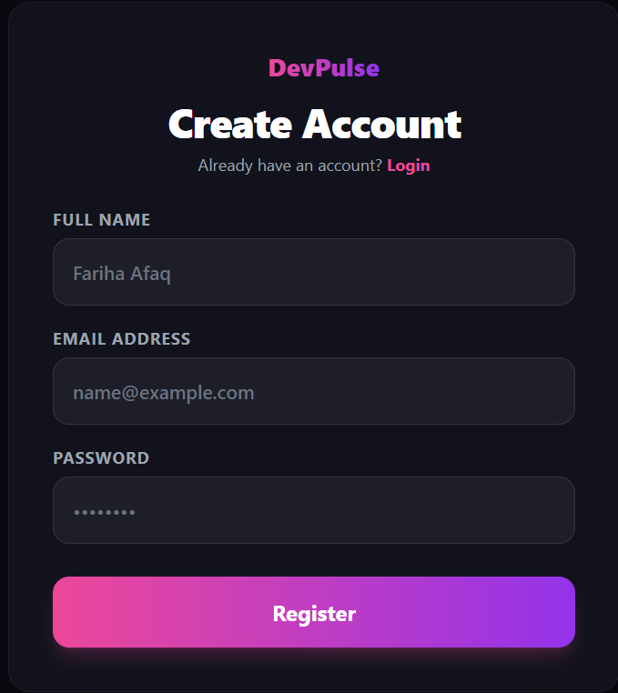
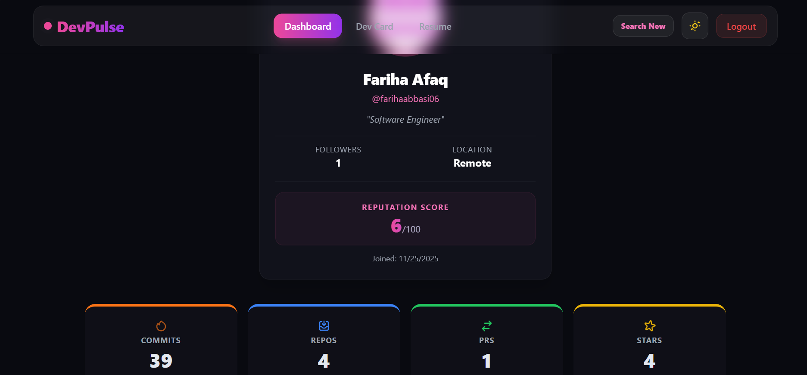
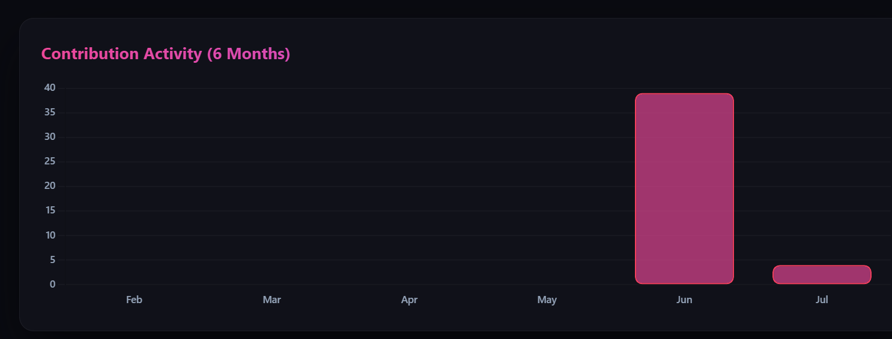
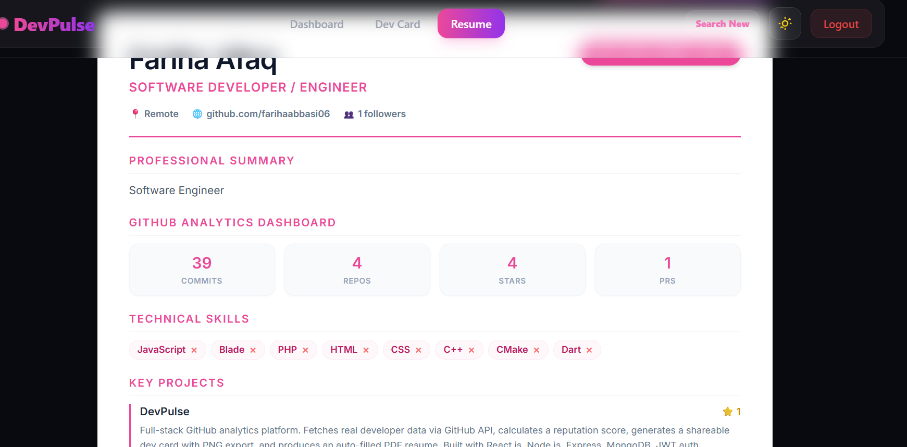
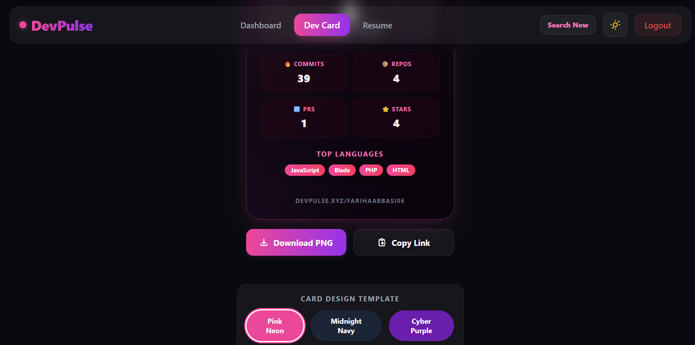

# 🚀 DevPulse – GitHub Developer Analytics Platform

<h3 align="center">
GitHub Developer Analytics Platform
</h3>

<p align="center">
Analyze GitHub developer profiles, calculate developer reputation, generate developer cards, visualize contribution activity, and create professional resumes.
</p>

---

# 📖 Table of Contents

- Overview
- Repository
- Features
- Project Structure
- Technology Stack
- Requirements
- Installation
- Environment Variables
- API Endpoints
- Screenshots
- Main Modules
- Dependencies
- Deployment
- Future Improvements
- Project Status
- Contributors
- Author
- License

---

# 📌 Overview

DevPulse is a full-stack GitHub Developer Analytics platform developed as a university semester project.

The application allows users to search GitHub profiles and provides detailed analytics including:

- Repository Statistics
- Commit Analysis
- Pull Request Statistics
- Contribution Activity
- Programming Languages
- Developer Reputation Score
- Developer Card Generation
- Resume Generation

The project contains two backend implementations:

- **Node.js + Express + MongoDB (Primary Backend)**
- **Laravel + MySQL (Alternative Backend)**

---

# 📂 Repository

### Frontend

- React.js

### Primary Backend

- Node.js
- Express.js
- MongoDB

### Alternative Backend

- Laravel
- MySQL

### External APIs

- GitHub REST API
- GitHub GraphQL API

---

# ✨ Features

## Authentication

- User Registration
- User Login
- Forgot Password (OTP)
- JWT Authentication
- Secure Password Hashing

---

## GitHub Analytics

- Search GitHub Users
- Repository Statistics
- Commit Count
- Pull Request Count
- Followers Count
- Stars Count
- Programming Language Analysis
- GitHub Contribution Calendar

---

## Developer Tools

- Developer Reputation Score
- Developer Card Generator
- Download Developer Card as PNG
- Resume Generator

---

## User Experience

- Responsive Design
- Loading Indicators
- Error Handling
- Mobile Friendly UI
- Modern Dashboard

---

# 📁 Project Structure

```text
DevPulse/
│
├── README.md
│
├── screenshots/
│
├── devpulse-frontend/
│
├── devpulse-backend/
│
└── devpulse-backend-laravel/
```

---

# 🛠 Technology Stack

## Frontend

- React.js
- Tailwind CSS
- Axios
- React Router DOM
- Chart.js
- html2canvas

---

## Backend

### Primary Backend

- Node.js
- Express.js
- MongoDB
- JWT
- Nodemailer

### Alternative Backend

- Laravel
- PHP
- MySQL

---

## APIs

- GitHub REST API
- GitHub GraphQL API

---

# ✅ Requirements

Before running this project, make sure you have installed:

- Node.js 18+
- npm
- MongoDB
- PHP 8+
- Composer
- MySQL / XAMPP
- Git

---

# ⚙ Installation

## Clone Repository

```bash
git clone https://github.com/farihaabbasi06/DevPulse.git

cd DevPulse
```

---

# 💻 Frontend Setup

```bash
cd devpulse-frontend

npm install

npm start
```

Frontend runs at:

```
http://localhost:3000
```

---

# 🟢 Node Backend Setup

```bash
cd devpulse-backend

npm install

npm start
```

Backend runs at:

```
http://localhost:5000
```

---

# 🔴 Laravel Backend Setup

```bash
cd devpulse-backend-laravel

composer install

cp .env.example .env

php artisan key:generate

php artisan migrate

php artisan serve
```

Laravel Backend runs at:

```
http://127.0.0.1:8000
```

---

# 🔐 Environment Variables

## Node Backend

Create `.env`

```env
PORT=5000

MONGO_URI=

JWT_SECRET=

EMAIL_USER=

EMAIL_PASS=

GITHUB_TOKEN=
```

---

## Laravel Backend

Create `.env`

```env
APP_KEY=

DB_DATABASE=

DB_USERNAME=

DB_PASSWORD=

JWT_SECRET=

GITHUB_TOKEN=
```

---

# 🔗 API Endpoints

## Authentication

```
POST /api/register

POST /api/login

POST /api/forgot-password

POST /api/reset-password
```

---

## GitHub Analytics

```
GET /api/user/:username

GET /api/repos/:username

GET /api/commits/:username

GET /api/pullrequests/:username

GET /api/contributions/:username
```

---

# 📸 Screenshots

<h2 align="center">Application Preview</h2>

<p align="center">


</p>

<p align="center">


</p>

<p align="center">


</p>

<p align="center">

</p>

---

# 📊 Main Modules

- Authentication
- Dashboard
- GitHub Analytics
- Developer Card
- Resume Generator
- Contribution Chart
- Programming Language Statistics
- Reputation Score

---

# 📦 Dependencies

## Frontend

- React
- Axios
- React Router DOM
- Tailwind CSS
- html2canvas
- Chart.js

Install dependencies

```bash
npm install
```

---

## Backend

- Express
- MongoDB
- Mongoose
- JWT
- Axios
- bcrypt
- Nodemailer
- dotenv

Install dependencies

```bash
npm install
```

---

# 🌐 Deployment

## Backend

- Render

## Frontend

- Vercel

---

# 🚀 Future Improvements

- GitHub OAuth Authentication
- PDF Resume Export
- AI Developer Insights
- Profile Comparison
- Leaderboard
- Dark Mode
- Additional GitHub Analytics

---

# 📈 Project Status

```
Version : 1.0

Status : Completed
```

---

# 👥 Contributors

- Fariha Abbasi

---

# 👩‍💻 Author

**Fariha Abbasi**

Software Engineering Student

COMSATS University Islamabad

Abbottabad Campus

GitHub: https://github.com/farihaabbasi06

---

# 📄 License

This repository is intended for educational and portfolio purposes.

You are welcome to explore the codebase, learn from the implementation, and use it as a reference for your own projects.